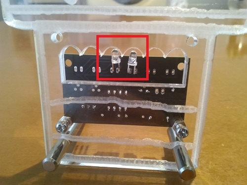

アクリルライトアップ基板を使う手順(シンプル版)
====

## 概要

* LEDを1組（2個）使用して、アクリルライトアップ基板をお手軽に使用するための手順です

## 必要なもの

* ATTiny13A x1　※LED点滅用のファームウェアは書き込み済み  
* 丸ピンICソケット（8pin） x1
* セラミックコンデンサ（0.1uF） x1
* 抵抗 1/4Ｗ　4.7ｋΩ x1
* LED x6 
* LED用の抵抗 x3　　※参考：著者は150Ωで使用している 
* MOSFET 2N7000 x3
* 電池ボックス（単３x２本）x1
* ピンヘッダ（2x3）x1 
* ジャンパワイヤ(オス-メス) x2
* ヤスリ
* ニッパ
* アクリル板　※加工済み  
* スタンド棒(M4)  
* 六角雄ねじスペーサー(M3、高さ：5mm)x2  
* 小ネジ(スペーサーをアクリル板に固定するためのもの)x2　※アクリル板に応じた「ねじ部」の長さが必要  
* ナット(スペーサーをプリント基板に固定するためのもの)x2  
※本手順で使用するLEDは1個だが、上記はLEDが3個の場合の部品数を記載している  

## 手順

1. 基板を切り離します  
   * 溝に従って基板を切り離します。(下記写真の赤線部分を切り離す)  
   　※ニッパを使って端を切り離し、その端の部分はヤスリできれいに磨くと良いです  

2. 各部品をはんだ付けします※LEDは「２．」ではまだ付けません  
   * マイコン(ATTiny13A)とLED以外の部品を付けます  
  
   * マイコン(ATTiny13A)を付けます  
   　※ATTinyの○（丸い溝）が1番ピン側に位置するようにします  
  
3. アクリル板に取り付けます  
   * アクリル板に付けます  
  
   * LEDをはんだ付けします  
   　※アクリル板の真ん中を照らすように位置を合わせます  
  
4. 動作確認  
   * ジャンパワイヤを介して、ピンヘッダ(2x3)の2番と6番ピンを電源の＋と－に繋げます  
  
   ※電池BOXを直接付けたい場合は「JP2」に付けてもOKです  

## Licence

   Licensed under the Apache License, Version 2.0 (the "License");
   you may not use this file except in compliance with the License.
   You may obtain a copy of the License at

       http://www.apache.org/licenses/LICENSE-2.0

   Unless required by applicable law or agreed to in writing, software
   distributed under the License is distributed on an "AS IS" BASIS,
   WITHOUT WARRANTIES OR CONDITIONS OF ANY KIND, either express or implied.
   See the License for the specific language governing permissions and
   limitations under the License.

